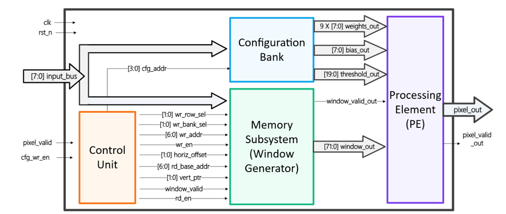
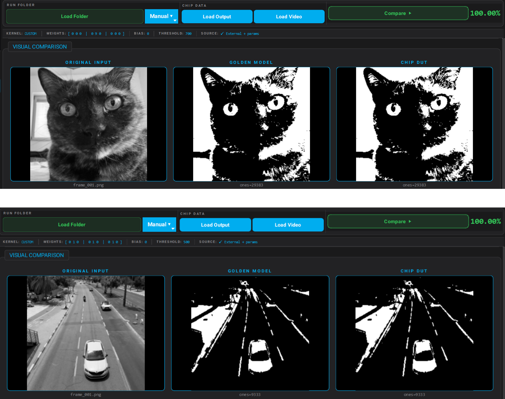
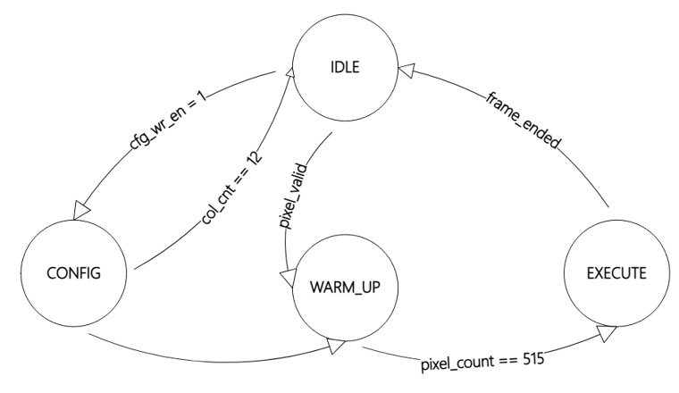
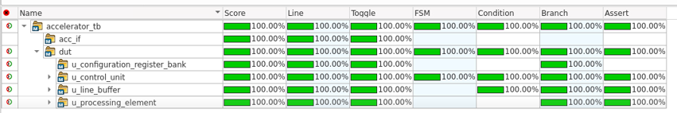
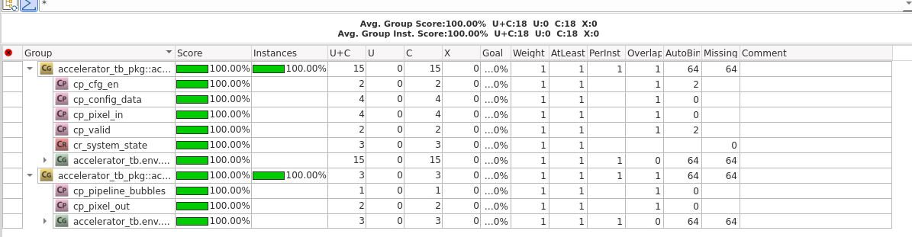
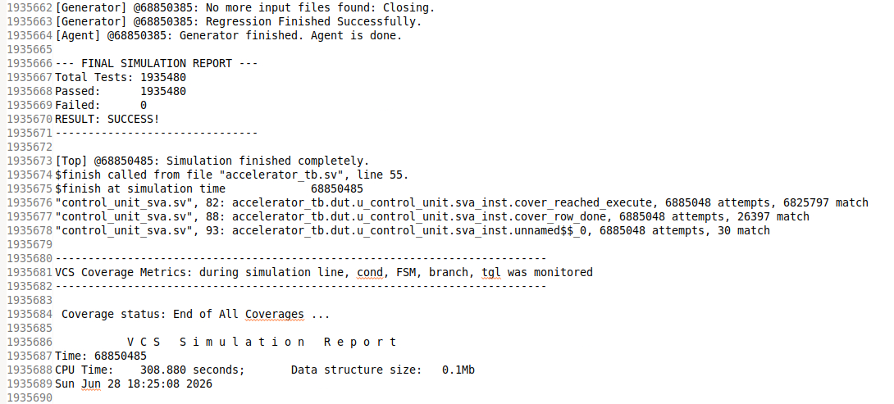
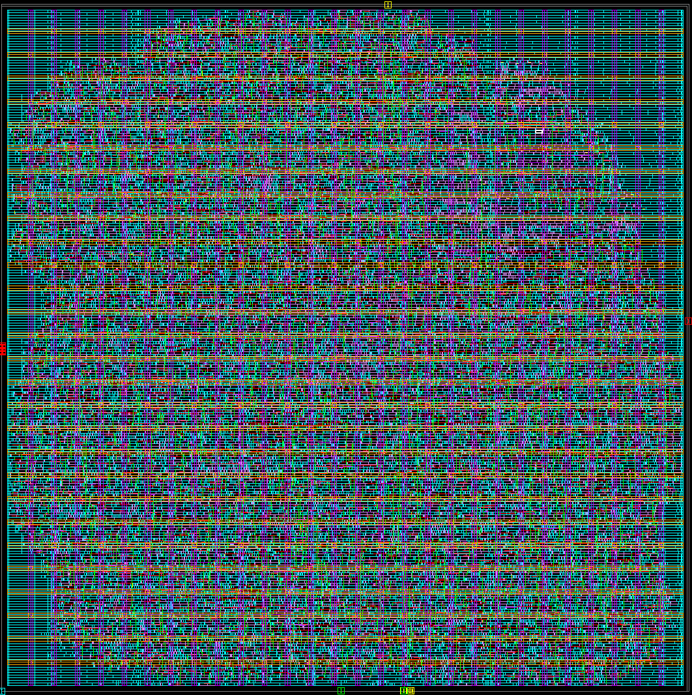
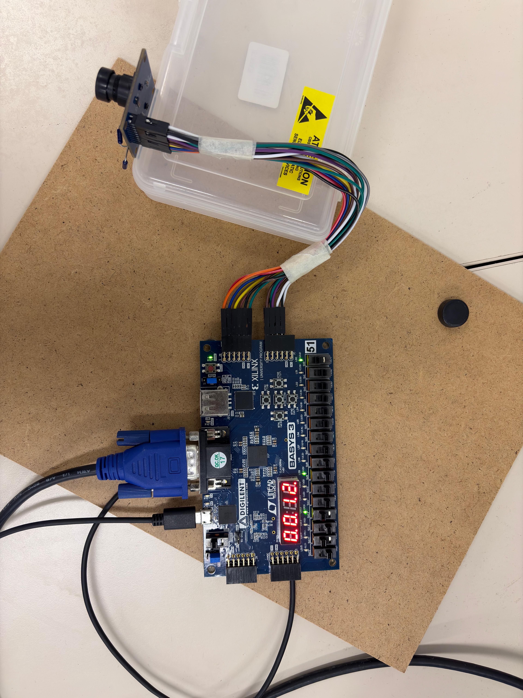

# 3x3 Convolution Hardware Accelerator (ASIC)

A configurable 3x3 convolution / feature-detector hardware accelerator, taken from RTL design through full verification, ASIC backend synthesis, and a live FPGA demo.

The core takes a raster-scanned 8-bit grayscale image stream, runs a programmable 3x3 kernel (weights, bias, threshold) over a sliding window using an interleaved triple-bank line-buffer memory, and outputs a 1-bit classification per pixel (`MAC > threshold`) at 1 pixel/cycle — **~6,100 256x256 frames/sec** at the sign-off clock frequency (400 MHz).

<p align="center">
  
</p>

## Highlights

- **RTL** — synthesizable SystemVerilog: control FSM, interleaved 3-bank line buffer (write steering / reordering / read address logic), processing element (MAC), configuration register bank.
- **Verification** — UVM-style, constrained-random class-based testbench environment (transaction / generator / driver / monitor / scoreboard / coverage, with `rand` fields and `constraint` blocks) for both the accelerator and the processing element, SystemVerilog Assertions (SVA) bound directly to the DUT for protocol/safety checking, a Python golden model used as the reference scoreboard, and gate-level simulation (GLS) against the synthesized netlist.
- **ASIC backend** — a full synthesis-to-routing flow (synthesis, floorplan, boundary/tap cells, power grid, placement, CTS, routing, filler cells) with timing/area/power/QoR reports.
- **FPGA live demo** — the accelerator was dropped into [Marc103/OV7670-with-FPGA-and-Demosaicing](https://github.com/Marc103/OV7670-with-FPGA-and-Demosaicing) to process a live OV7670 camera feed on a Nexys-3 board and display the result on VGA in real time.
- **Verification GUI** — a standalone PyQt6 desktop app that runs the golden model, visualizes the memory/PE architecture, and compares Python vs. RTL output on real images.

## Key results

| | |
|---|---|
| Regression | **1,935,480 tests run — 0 failures** |
| Coverage | **100%** line / toggle / FSM / condition / branch / assertion, **100%** functional coverage groups, after justified exclusions of unreachable, reserved, and non-functional cases |
| Clock | 2.5 ns period (400 MHz), 0 setup/hold violations, positive slack on every path group |
| Throughput | **~6,100 frames/sec** at 256x256 (1 pixel/cycle streaming, 400 MHz / 65,536 pixels per frame) |
| Backend | Full synthesis → floorplan → placement → CTS → routing → filler cells, ~62% utilization |
| Power | ~1.72 mW total (1.70 mW dynamic + 23 µW leakage) at sign-off corner |

## Proof it works: golden model vs. ASIC-targeted RTL

The same images were run through the Python golden model and through the actual RTL simulation. Output matches bit-for-bit on real-world test images:

<p align="center">
  
</p>

The control FSM that drives the whole pipeline (config load → line-buffer warm-up → real-time execute):

<p align="center">
  
</p>

100% line/toggle/FSM/condition/branch/assertion coverage was closed across every RTL block (after justified exclusions of unreachable, reserved, and non-functional cases), backed by 100% functional coverage group closure and a clean full regression (1,935,480 tests, 0 failures):

<p align="center">
  
</p>
<p align="center">
  
</p>
<p align="center">
  
</p>

The design was carried all the way through place & route to a final physical layout:

<p align="center">
  
</p>

And finally brought up live on an FPGA, processing a real camera feed end-to-end:

<p align="center">
  
</p>

(full clip: [`FPGA/demo/fpga_demo.mp4`](FPGA/demo/fpga_demo.mp4))

## Repository structure

```
rtl/                   Synthesizable SystemVerilog design (accelerator core)
verif/                  Testbenches, UVM-style env, SVA, gate-level simulation (verif/gls)
syn/                    Synthesis & ASIC backend scripts (syn/scripts) and reports (syn/reports)
constraints/            SDC timing constraints
coverage/               Functional/code coverage and regression summary screenshots
waveforms/              Annotated simulation waveform screenshots
docs/                   Architecture diagrams (top-level, memory, control unit, PE, FSM, timing)
verification_model/     Standalone PyQt6 "ASIC Verification & Analysis Suite" (golden model + GUI)
FPGA/                   FPGA integration wrapper + live demo photo/video (see FPGA/README.md)
ARCH.pdf                Full architecture / design report
Poster3369.pdf          Project poster
```

## RTL simulation (VCS / Verdi)

The compilation unit is described in [build.cud](build.cud); targets are in the [Makefile](Makefile).

```
make comp   # compile with VCS (coverage instrumented)
make run    # run the simulation
make waveverdi  # open waveforms in Verdi
make coverage   # open coverage in Verdi
```

Gate-level simulation against the synthesized netlist lives in [verif/gls](verif/gls) with its own `Makefile`/`build.cud`.

## ASIC synthesis flow

Numbered Tcl scripts in [syn/scripts](syn/scripts) run the backend flow in order (synthesis → floorplan → boundary/tap cells → power grid → placement → CTS → routing → filler cells). Resulting reports (area, power, timing, QoR, utilization) are in [syn/reports](syn/reports).

## Verification GUI ("ASIC Verification & Analysis Suite")

A PyQt6 desktop app under [verification_model/](verification_model) runs the Python golden model and lets you generate kernels, visualize the memory/PE pipeline, and diff golden-model output against real RTL simulation output on actual images.

```
cd verification_model
pip install -r requirements.txt
python main.py
```

See [verification_model/README.md](verification_model/README.md) for details.

## FPGA live demo

The accelerator was integrated as a drop-in stage into the open-source [OV7670-with-FPGA-and-Demosaicing](https://github.com/Marc103/OV7670-with-FPGA-and-Demosaicing) project to demonstrate it processing a real, live camera feed on hardware. See [FPGA/README.md](FPGA/README.md) for the integration wrapper, wiring instructions, and demo photo/video.

## Credits

- FPGA camera capture/demosaicing/VGA display pipeline: [Marc103/OV7670-with-FPGA-and-Demosaicing](https://github.com/Marc103/OV7670-with-FPGA-and-Demosaicing) — the accelerator in this repo was integrated into that project for the live hardware demo.

## Authors

- [@royfriedman1](https://github.com/royfriedman1)
- Idan Marchevsky

## License

See [LICENSE](LICENSE).
